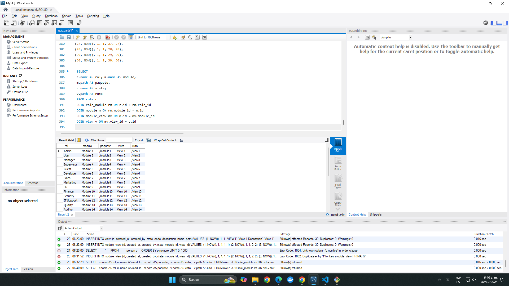

## Obtener de manera ordenada la lista de vistas y modulos a los que tiene acceso un rol en estado activo. 
    role[name=> rol, route => ruta]
    module[name=> modulo, route => paquete]
    
    SELECT 
 r.name AS rol, m.name AS modulo,
 m.path AS paquete,
 v.name AS vista, 
 v.path AS ruta 
 FROM role r
 JOIN role_module rm ON r.id = rm.role_id
 JOIN module m ON rm.module_id = m.id 
 JOIN module_view mv ON m.id = mv.module_id 
 JOIN view v ON mv.view_id = v.id 
 WHERE r.state = 1 
 
 # Resultado

 
 